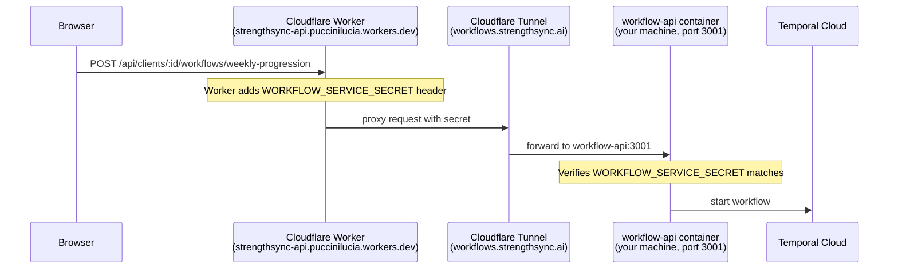
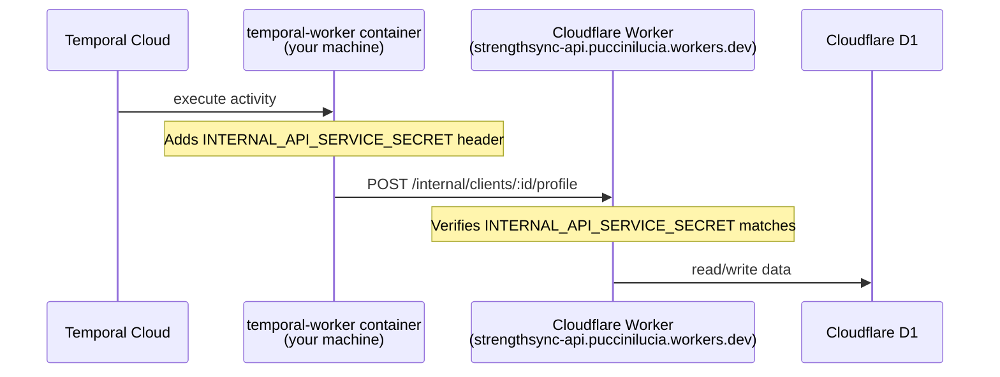

```mermaid
sequenceDiagram
participant Browser
participant Worker as Cloudflare Worker<br/>(strengthsync-api.puccinilucia.workers.dev)
participant Tunnel as Cloudflare Tunnel<br/>(workflows.strengthsync.ai)
participant LocalAPI as workflow-api container<br/>(your machine, port 3001)
participant Temporal as Temporal Cloud

    Browser->>Worker: POST /api/clients/:id/workflows/weekly-progression
    Note over Worker: Worker adds WORKFLOW_SERVICE_SECRET header
    Worker->>Tunnel: proxy request with secret
    Tunnel->>LocalAPI: forward to workflow-api:3001
    Note over LocalAPI: Verifies WORKFLOW_SERVICE_SECRET matches
    LocalAPI->>Temporal: start workflow
```

```mermaid
sequenceDiagram
    participant Temporal as Temporal Cloud
    participant LocalWorker as temporal-worker container<br/>(your machine)
    participant Worker as Cloudflare Worker<br/>(strengthsync-api.puccinilucia.workers.dev)
    participant D1 as Cloudflare D1

    Temporal->>LocalWorker: execute activity
    Note over LocalWorker: Adds INTERNAL_API_SERVICE_SECRET header
    LocalWorker->>Worker: POST /internal/clients/:id/profile
    Note over Worker: Verifies INTERNAL_API_SERVICE_SECRET matches
    Worker->>D1: read/write data

```

Two secrets, two directions:

WORKFLOW_SERVICE_SECRET: Worker → your machine ("start this workflow")
INTERNAL_API_SERVICE_SECRET: your machine → Worker ("read/write this data")
