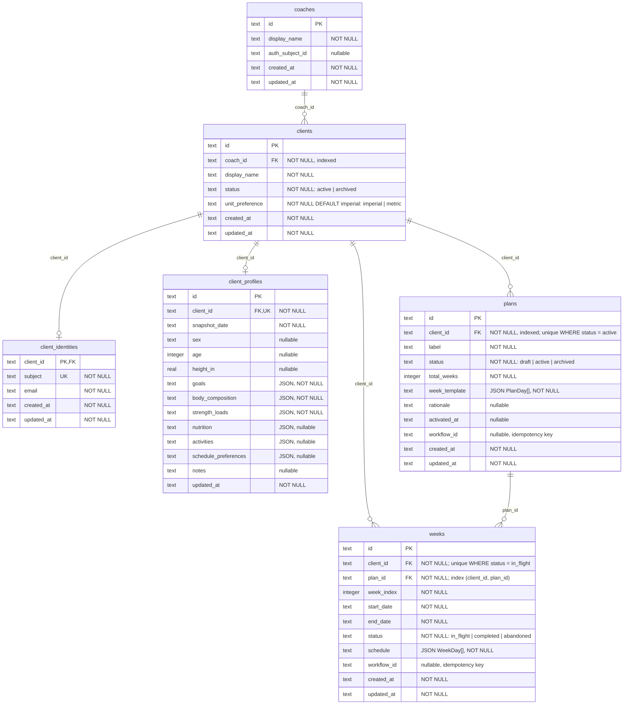

# Domain model (ER draft)

Vendor-agnostic, deliberately small production model. It keeps SQL for ownership, lifecycle, and history, but does **not** turn every day, exercise, and set into a database entity.

The plan is a structured document; each concrete week is a structured log. The database has five core records: **Coach → Client → ClientProfile / Plan / Week**, plus one auth table, `client_identities`, that maps a client to its identity-provider subject.

The diagram matches `server/src/db/schema.ts` and the migrations in `server/db/drizzle/` exactly: one entity per table, one attribute per column, with the SQLite storage type. Timestamps and dates are ISO-8601 `text`. JSON columns are `text` in SQLite and are validated by the Zod schemas in `server/src/domain/model/`.



| Index | Table | Columns | Kind |
| --- | --- | --- | --- |
| `clients_coach_id_idx` | `clients` | `coach_id` | index |
| `client_identities_subject_unique` | `client_identities` | `subject` | unique |
| `client_profiles_client_id_unique` | `client_profiles` | `client_id` | unique |
| `plans_client_id_idx` | `plans` | `client_id` | index |
| `plans_one_active_per_client` | `plans` | `client_id` `WHERE status = 'active'` | partial unique |
| `weeks_client_plan_idx` | `weeks` | `client_id, plan_id` | index |
| `weeks_one_in_flight_per_client` | `weeks` | `client_id` `WHERE status = 'in_flight'` | partial unique |

All foreign keys are `ON UPDATE no action ON DELETE no action`.

```typescript
type Uuid = string;
type ISODate = string;
type ISODateTime = string;

type DayType = "upper_body" | "leg_day" | "full_body" | "rest" | "activity" | "cardio";
type ClientStatus = "active" | "archived";
type PlanStatus = "draft" | "active" | "archived";
type WeekStatus = "in_flight" | "completed" | "abandoned";
type ExerciseFeedback = "easy" | "hard" | "heavy" | "light";
type UnitPreference = "imperial" | "metric";
```

---

## Coach

```typescript
type Coach = {
  id: Uuid;
  display_name: string;
  auth_subject_id: string | null;
  created_at: ISODateTime;
  updated_at: ISODateTime;
};
```

## Client

```typescript
type Client = {
  id: Uuid;
  coach_id: Uuid; // FK → Coach
  display_name: string;
  status: ClientStatus;
  unit_preference: UnitPreference;
  created_at: ISODateTime;
  updated_at: ISODateTime;
};
```

## ClientIdentity (`client_identities`)

Maps a client to its subject at the identity provider. It is an auth record, not part of the public domain model; there is no Zod schema for it in `server/src/domain/model/`. See [auth.md](./auth.md).

```typescript
type ClientIdentity = {
  client_id: Uuid; // PK and FK → Client: one identity per client
  subject: string; // unique; the identity-provider subject
  email: string; // cache of the provider email at provisioning time
  created_at: ISODateTime;
  updated_at: ISODateTime;
};
```

**Invariant:** the unique constraint on `subject` prevents two clients for one person when two first requests arrive at the same time.

## ClientProfile

One current coaching profile per client. Keep complex, rarely-filtered coaching information as JSON rather than prematurely normalizing it.

```typescript
type ClientProfile = {
  id: Uuid;
  client_id: Uuid; // FK → Client, unique
  snapshot_date: ISODate;
  sex: string | null;
  age: number | null;
  height_in: number | null;
  goals: Record<string, unknown>;
  body_composition: Record<string, unknown>;
  strength_loads: Record<string, unknown>;
  nutrition: Record<string, unknown> | null;
  activities: Record<string, unknown> | null;
  schedule_preferences: Record<string, unknown> | null;
  notes: string | null;
  updated_at: ISODateTime;
};
```

**Invariant:** every measurement in this model is imperial — pounds and
inches — and names its unit in the field. That holds for storage, for the API,
and for what the coaching prompts read; kilograms and centimetres exist only as
something the client renders for an athlete who has asked for it. Which
athletes those are lives in `clients.unit_preference` (`'imperial' | 'metric'`,
defaulting to `'imperial'`), which travels with the `Client` on every read and
is written by `PATCH /api/me` — the only writer of that column. The suffix is load-bearing rather than decorative: these values pass
through free-form JSON columns that nothing type-checks and into prompts the
model reads literally, so the unit has to travel with the value.

`goals`, `body_composition` and `strength_loads` carry weights inside their
free-form JSON and so follow the same rule in their *keys*: onboarding writes
`{ target_weight_lb }`, `{ weight_lb, body_fat_percent? }`, and
`{ experience, lifts: { squat_lb?, bench_press_lb?, deadlift_lb?,
overhead_press_lb? } }` respectively. A bare `squat` key would leave the model
inferring a unit from context.

`activities` is whatever the client does outside lifting — swimming, cycling, a
pilates class. Free-form like its siblings, but the convention is
`{ items: [...] }` with each item shaped `{ name, sessions_per_week, days?,
note? }`. Coaching rules use it to plan around a client's other sport rather
than stack training on top of it.

`nutrition` is likewise free-form; onboarding writes `{ eating_phase?,
protein_target_g? }` when the client answers those questions, though the
column accepts richer data than that vocabulary allows (see the demo seed).
`schedule_preferences` gains `daily_activity_level` from the same step,
alongside `days_per_week` and `rest_day`.

## Plan

One generated or imported training block. `week_template` replaces `BlockWeekTemplate`, `TemplateDay`, and `TemplateExercise` as separate records.

```typescript
type Plan = {
  id: Uuid;
  client_id: Uuid; // FK → Client
  label: string; // e.g. "Block 2"
  status: PlanStatus;
  total_weeks: number;
  week_template: PlanDay[];
  rationale: string | null;
  activated_at: ISODateTime | null;
  created_at: ISODateTime;
  updated_at: ISODateTime;
};

type PlanDay = {
  day_index: number; // 1–7
  type: DayType;
  notes: string | null;
  exercises: PlannedExercise[];
};

type PlannedExercise = {
  /** Stable history key, e.g. `press_banca`. */
  exercise_key: string;
  name: string;
  series: number;
  reps: number;
  rest_time_sec: number;
  weight_lb: number | null;
  notes: string | null;
};
```

**Invariant:** at most one active plan per client (partial unique index `plans_one_active_per_client`). Activating a plan archives the previous active plan; it does not delete it.

The `plans` table also has a nullable `workflow_id` column. It is the idempotency key for the workflow or request that created the row. It is not part of the `Plan` type above.

## Week

A concrete, dated log for one plan week. It owns completion and performance data, and may include adjustments made by the weekly AI workflow. It replaces `WeekInstance`, `DayInstance`, and `ExerciseInstance`.

```typescript
type Week = {
  id: Uuid;
  client_id: Uuid; // FK → Client
  plan_id: Uuid; // FK → Plan
  week_index: number; // 1 .. plan.total_weeks
  start_date: ISODate;
  end_date: ISODate;
  status: WeekStatus;
  /** Snapshot of the planned work for this week, including AI adjustments. */
  schedule: WeekDay[];
  created_at: ISODateTime;
  updated_at: ISODateTime;
};

type WeekDay = {
  day_index: number;
  date: ISODate;
  type: DayType;
  notes: string | null;
  completed: boolean;
  completed_at: ISODateTime | null;
  exercises: ExerciseLog[];
};

type ExerciseLog = {
  /** Matches the plan exercise unless the week intentionally changes it. */
  exercise_key: string;
  name: string;
  /** The athlete did not perform this exercise this week. */
  skipped: boolean;
  /** Controlled athlete feedback; not free-form coaching notes. */
  feedback: ExerciseFeedback | null;
  prescribed: {
    series: number;
    reps: number;
    rest_time_sec: number;
    weight_lb: number | null;
    notes: string | null;
  };
  /** One entry per performed set; can be empty before training. */
  sets: Array<{
    performed_reps: number;
    performed_weight_lb: number | null;
  }>;
};
```

The `weeks` table also has a nullable `workflow_id` idempotency key, the same as `plans`. It is not part of the `Week` type above.

**Invariants:**
- At most one `in_flight` week per client (partial unique index `weeks_one_in_flight_per_client`).
- A completed week remains immutable except for explicit coach corrections.
- `schedule` is a snapshot. Subsequent plan edits must not rewrite historical weeks.
- A skipped exercise has `skipped: true` and normally no performed sets.

---

## Lifecycle

1. Generate/import a `Plan` with its canonical `week_template`.
2. Activate it and create `Week` 1 by copying the template into `schedule`.
3. The user records set results in `Week.schedule[].exercises[].sets`.
4. Complete the week; use its logs as workflow input, then create the next `Week` with any AI adjustments.
5. Generate a new plan at block end; archive the old plan but retain every old week.

---

## Why this is still SQL

`Coach`, `Client`, `ClientIdentity`, `ClientProfile`, `Plan`, and `Week` are SQL rows with IDs, ownership, timestamps, statuses, and foreign keys. `Plan.week_template` and `Week.schedule` are JSON columns validated by shared Zod schemas.

This keeps the important queries simple:

- active plan / current week for a client
- all completed weeks for a plan
- plan and week history per client

It deliberately postpones cross-client analytics such as “all bench-press sets across every athlete.” If that becomes a real feature, extract `ExerciseLog` into relational rows later; do not pay that complexity before it is needed.

---

## Explicitly out of this file

- Organization / membership / SaaS roles
- `JobRun` / `LlmCall` product database tables — workflow LLM traces are forwarded to the observability/evaluation provider, not stored here
- Chat session storage
- Full exercise catalog
