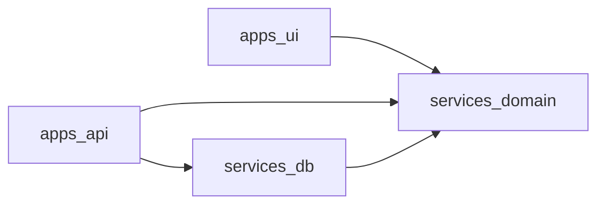

# Monorepo structure and dependency rules

Target repository structure for the production application. It defines ownership and import boundaries, not a choice of deployment vendor or build orchestrator.

```text
apps/
  ui/                         # Browser application
  api/                        # Public HTTP API, chat routing, and Cloudflare Workflow
    src/
      workflows/              # Cloudflare Workflow entrypoint + step logic
        strengthsync-workflow.ts      # StrengthsyncWorkflow: weekly progression + plan turnover
      agent/                  # In-Worker LLM helpers used by workflow steps
services/
  domain/                     # Contracts and pure business logic
  db/                         # Database schema, migrations, and repositories
```

Each directory is a workspace package with its own `package.json`, TypeScript config, tests, and explicit dependencies. The root workspace owns shared linting, formatting, TypeScript base config, task scripts, and lockfile.

The former `apps/workflows` package (Temporal-era Node worker, activities, Braintrust recorder, Docker image) and `services/agent` (runtime-agnostic LLM helper package) are retired in the Cloudflare Workflows migration; see [stack.md](./stack.md).

## Dependency graph



The graph is deliberately one-way:

- `services/domain` imports **nothing** from the other project workspaces.
- `services/db` imports `services/domain` types/contracts where useful, never apps. With D1, only the Cloudflare Workers runtime (the `apps/api` Worker, including its workflow) imports it.
- Apps may import services, but **never each other**. The workflow is not a separate app: it is a Cloudflare Workflow entrypoint inside `apps/api` that imports `services/db` and `services/domain` directly; LLM helpers live in `apps/api/src/agent`.

## `apps/ui`

Browser-only React application.

**Owns**

- Screens and components: plan tracker, history, chat panel
- Client-side state, navigation, optimistic updates, polling job status
- Calls to the public API

**May import**

- `services/domain/contracts`: API request/response types and Zod schemas safe for the browser
- `services/domain/presentation`: pure display helpers, constants, day types

**Must not import**

- `services/db`
- `services/agent`
- Workflow entrypoint or step code
- Server environment variables, filesystem, Node-only packages

**Dependency rule:** UI only knows HTTP contracts. It never knows a database table, SQL query, workflow step, or provider SDK.

## `apps/api`

The only browser-facing backend. Its runtime must support HTTP, streaming chat, authentication, database access, and durable workflow execution.

**Owns**

- Authentication and authorization boundary
- Public REST/RPC endpoints for clients, profiles, plans, and weeks
- Validation of browser inputs
- Chat session routing and streaming response
- The Cloudflare Workflow: `StrengthsyncWorkflow` entrypoint (`src/workflows/strengthsync-workflow.ts`), its steps, retry policy, and `/wf/*` start routes

**May import**

- `services/domain`
- `services/db` for the public data API and in-Worker workflow data access
- Cloudflare Workers platform bindings (`DB`, `STRENGTHSYNC_WORKFLOW`)
- Its own runtime/platform adapter code, including in-Worker LLM helpers under `src/agent`

**Must not import**

- `apps/ui`

**Dependency rule:** data-plane reads/writes and durable workflow steps both execute in this single Worker. API requests start a workflow and return immediately; they must not remain open for LLM work.

## `apps/workflows` (retired)

The Temporal-era package `apps/workflows` — Node worker, private start API, activities, Braintrust recorder, and Docker image — is retired in the Cloudflare Workflows migration. Workflow definitions, steps, and LLM calls now live inside `apps/api` as a Cloudflare Workflow. Its evals and fixtures are being relocated per [evals.md](./evals.md). Do not re-introduce a separate workflow process or a machine-to-machine start boundary.

## `services/domain`

Pure shared business language. It must work in browser, edge, and Node runtimes.

**Owns**

- Domain types and Zod schemas: `Coach`, `Client`, `ClientProfile`, `Plan`, `Week`, schedules, logs
- Public API request/response DTOs
- LLM input/output DTOs and mapping/validation functions
- Coaching rules and prompt builders
- Pure lifecycle rules, e.g. “which plan status transition is valid”

**May import**

- Runtime-neutral packages only, e.g. Zod

**Must not import**

- Database clients/ORMs
- HTTP frameworks, platform SDKs, Node APIs, filesystem
- LLM provider SDKs
- Any `apps/*` package

**Public exports**

```text
@strengthsync/domain/contracts   # browser-safe DTOs and schemas
@strengthsync/domain/model       # core entities and value types
@strengthsync/domain/coach       # rules, prompts, LLM DTO mapping
```

Do not expose internal file paths as a de facto API. Each package should define a short explicit export surface.

## `services/db`

Persistence adapter for the relational system of record.

**Owns**

- Drizzle schema, migrations, indexes, and D1 repository helpers
- Repository/query functions for `Coach`, `Client`, `ClientProfile`, `Plan`, and `Week`
- Persistence mappings between SQL JSON columns and `services/domain` contracts

**May import**

- `services/domain`
- ORM/query client and database driver

**Must not import**

- `services/agent`
- `apps/*`
- HTTP or workflow SDKs

**Dependency rule:** expose intent-level operations (`getCurrentWeek`, `completeWeek`, `createNextWeek`) to `apps/api`, not raw SQL tables. Multi-write lifecycle invariants use Drizzle's D1 `db.batch([...])` operations; do not use standard ORM transactions with D1.

## Workspace setup

Use the existing `pnpm` package manager in workspace mode.

```yaml
# pnpm-workspace.yaml
packages:
  - apps/*
  - services/*
```

Root responsibilities:

```text
package.json                  # shared scripts: typecheck, lint, test, build
pnpm-workspace.yaml           # workspace discovery
tsconfig.base.json            # strict shared compiler settings
eslint.config.*               # import-boundary and code-quality rules
```

Per-workspace responsibilities:

```text
apps/ui/package.json
apps/ui/tsconfig.json
apps/api/package.json
apps/api/tsconfig.json
services/domain/package.json
services/domain/tsconfig.json
services/db/package.json
services/db/tsconfig.json
```

Declare workspace dependencies explicitly (for example, `"@strengthsync/domain": "workspace:*"`). Do not rely on root dependency hoisting: a workspace must list every runtime package it imports.

## Enforcement

- TypeScript project references build shared services before apps.
- Turborepo (see [`turborepo.md`](./turborepo.md)) runs `typecheck`/`lint`/`test`/`build`
  in the same dependency order, and can scope a run to only affected packages.
- Package `exports` prevent deep imports across workspaces.
- ESLint import restrictions enforce the graph above.
- CI runs root typecheck, lint, unit tests, and a dependency-graph check,
  scoped to affected packages; `apps/api` deploys automatically on `main`
  (see [`ci_cd.md`](../operations/ci_cd.md)).
- Separate runtime TypeScript configs: browser (`ui`) and edge (`api`, which also hosts the in-Worker workflow). Shared services must compile against every runtime they claim to support.
- Workflow orchestration tests are deferred: the Cloudflare Workflow runtime is not exercised in the test suite.

## Migration mapping

| Current POC path                                   | Target workspace                         |
| -------------------------------------------------- | ---------------------------------------- |
| `src/ui/`                                          | `apps/ui/`                               |
| `src/worker/`                                      | `apps/api/`                              |
| `src/temporal/`                                    | Retired → `apps/api/src/workflows/` as a Cloudflare Workflow |
| `src/agent/`                                       | `apps/api/src/agent/`                    |
| `src/temporal/schemas.ts`, prompts, coaching rules | `services/domain/`                       |
| `src/app/dashboard/**`                             | fixtures/seed inputs; no runtime storage |
