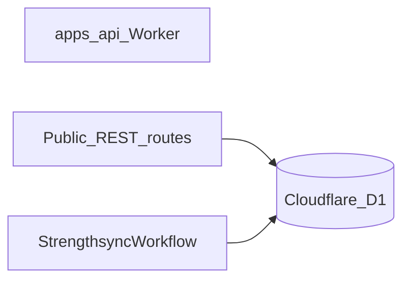

# MVP stack

Committed providers and platform choices for the MVP. This is intentionally a small, low-operations stack; free usage is used where it is genuinely available, not assumed where it is only a trial.

## Decisions

| Concern | MVP choice | Free-usage status | Decision |
| --- | --- | --- | --- |
| Product access | HTTP Basic Authentication | No provider cost | Use one shared coach credential, enforced by the API Worker |
| Public API + chat | Hono on Cloudflare Workers | Yes | Use the existing Worker direction |
| SQL database | Cloudflare D1 + Drizzle ORM | Yes | Use D1 as the system of record and Drizzle as its typed data layer |
| Workflow orchestration | Cloudflare Workflows (in-Worker) | Yes | One workflow (`StrengthsyncWorkflow`) runs weekly progression and plan turnover; no local worker or tunnel |
| LLM evals/tracing | Braintrust | Yes | Target for workflow LLM calls; not wired in this pass and will be redefined in `apps/api/src/agent` when tracing returns (see [evals.md](./evals.md)) |
| General platform observability | Cloudflare | Included platform telemetry | Use Cloudflare logs/analytics for Worker and D1 operations |
| CI/CD | GitHub Actions | Yes | Build, test, and deploy from GitHub Actions |
| LLM | OpenAI API | No guaranteed permanent free tier | Continue with the current provider; set a spending limit |

## Access: HTTP Basic Authentication

Use Hono's Basic Auth middleware (or an equivalent constant-time credential check) at the edge.

- Store the shared username/password as Worker secrets, never in the browser bundle or repository.
- Require HTTPS; Basic credentials are sent on every authenticated request and are only Base64-encoded, not encrypted by the scheme itself. See [RFC 7617 background](https://en.wikipedia.org/wiki/Basic_access_authentication).
- Protect all data, workflow-start, and chat routes. Static SPA assets may be public because they contain no client data; if the entire app must be password-protected, route asset delivery through the Worker after the same check.
- This is **not user identity**: it has no per-user ownership, roles, invitation flow, or reliable logout. It is appropriate only while the MVP is private and single-coach.

No external auth provider is needed for the MVP. Replacing this later with real identity must happen before exposing client-facing accounts.

## Cloudflare Workers + Hono

Cloudflare Workers remains the public API, SPA edge layer, streaming chat gateway, and D1 access layer. Hono is the HTTP framework.

The Workers Free plan currently includes 100,000 requests per day and 10 ms CPU per request ([pricing](https://developers.cloudflare.com/workers/platform/pricing/), [limits](https://developers.cloudflare.com/workers/platform/limits/)). That is sufficient for a small private MVP; move to Workers Paid before traffic or API CPU work requires it.

## Cloudflare D1

D1 is the relational system of record for `Coach`, `Client`, `ClientProfile`, `Plan`, and `Week` described in [domain_model.md](./domain_model.md). `services/db` uses Drizzle ORM's D1 driver for its schema, migrations, typed queries, and repository layer.

The D1 Free plan currently includes 5 million rows read/day, 100,000 rows written/day, and 5 GB total storage; per-database size is 500 MB and free-plan query access stops until the daily reset if an allowance is exceeded ([pricing](https://developers.cloudflare.com/d1/platform/pricing/), [limits](https://developers.cloudflare.com/d1/platform/limits/)).

### Workflow data access

The MVP's workflow is a Cloudflare Workflow running **inside** `apps/api`. It receives the `DB` binding the same way the public API does and uses `createDb(this.env.DB)` to read and write D1 directly. There is no separate worker process, private tunnel, or machine-to-machine internal API.

- `apps/api` owns all D1 reads/writes, whether from a request handler or a workflow step.
- `STRENGTHSYNC_WORKFLOW` binds the `StrengthsyncWorkflow` entrypoint to the Worker (see [workflows.md](./workflows.md)).
- The browser never reaches D1 directly.
- There is one data writer boundary: the Worker itself.

This removed the Temporal-era two-process bridge (Node worker → `/internal/*` API). Retiring that bridge is part of the Cloudflare Workflows migration; `/internal/*` routes were removed entirely.

### Atomic writes

D1 does not support standard `BEGIN`/`COMMIT` transactions. It does provide atomic `batch()` execution: if a statement in the batch fails, D1 rolls back the sequence ([D1 batch documentation](https://developers.cloudflare.com/d1/worker-api/d1-database/)).

Use Drizzle's D1 `db.batch([...])` API for lifecycle commands that must be atomic, including archiving the old plan, activating a new plan, and creating week 1. Never use `db.transaction()` with D1.

## Workflow orchestration: Cloudflare Workflows

The MVP runs the weekly-turn workflow as a Cloudflare Worker Workflow inside `apps/api`, bound as `STRENGTHSYNC_WORKFLOW`. Durable execution is provided by the platform: each `step.do` records its output, steps re-run only after a real failure, and the instance resumes after a crash. See [workflows.md](./workflows.md) for the step model, the plan-turnover branch, and the retry policy.

There is no local worker, Docker Compose project, Cloudflare Tunnel, or Temporal deployment to operate. `wrangler deploy` ships the workflow alongside the public API, so the workflow is available whenever the Worker is deployed.

Workflow-visible retries and failure policy live in the workflow definition (`apps/api/src/workflows/strengthsync-workflow.ts`) and in [workflows.md](./workflows.md) — not in a separate orchestration service.

### Why not Temporal

The prior design ran two Temporal workflows (`apps/workflows`) on a local Node machine and paid Temporal Cloud credits. The Cloudflare Workflow consolidates those two processes into one in-Worker durable run on the Free plan; it also removes the local machine as a runtime dependency and the `$100/month` Temporal Cloud post-trial cost.

## Evals and LLM observability: Braintrust (deferred)

Braintrust remains the target for workflow LLM traces and evals, but it is **not wired in
this pass**.

The prior `apps/workflows` implementation created a Braintrust-backed `LlmCallRecorder` and
passed it to `services/agent`; every LLM call—including failures—emitted its trace before the
activity returned. Both `apps/workflows` and `services/agent` were deleted in the Cloudflare
Workflows migration. The in-Worker agent runtime (`apps/api/src/agent/agent-core.ts`) currently
uses the Vercel AI SDK directly with no recorder. The recorder contract will be defined fresh
inside `apps/api/src/agent` when tracing returns; see [evals.md](./evals.md).

- Traces, prompts, outputs, latency, and evaluation scores will live in Braintrust, not D1.
- D1 remains product data only; do not introduce `LlmCall` tables for the MVP.

Braintrust Starter is a permanent $0 plan with 1 GB processed data/month, 10,000 scores/month,
and 14-day retention ([pricing](https://www.braintrust.dev/pricing),
[billing](https://www.braintrust.dev/docs/admin/billing)). This fits an MVP but requires a
retention/overage review before production volume grows.

Cloudflare covers platform-level Worker/D1 logs and operational metrics. Braintrust will cover
LLM-specific traces and evals once reconnected; they are complementary.

## CI/CD: GitHub Actions

GitHub Actions is the MVP pipeline:

1. Pull request: install, typecheck, lint, and unit tests.
2. Main: build and deploy `apps/api` — including the `StrengthsyncWorkflow` entrypoint — and run schema migrations through the API/Worker deployment path.
3. Workflow orchestration tests are deferred: the Cloudflare Workflow runtime is not exercised in the test suite.

GitHub Free currently includes 2,000 minutes/month and 500 MB artifact storage for private repositories; public-repository Actions usage is free ([GitHub Actions billing](https://docs.github.com/en/billing/concepts/product-billing/github-actions)). Keep artifacts small and configure an Actions spending limit.

## LLM: OpenAI API

Keep OpenAI for the MVP because the current agent core already uses it. This is a paid dependency; do not model it as a reliable free tier. Set a project budget, model allowlist, and per-workflow token limit from day one.

Do not opt into data-sharing token programs for client health/training context without an explicit privacy decision.

## Cost reality

The free-tier requirement is satisfied by Workers, Cloudflare Workflows, D1, Braintrust Starter, and GitHub Actions. It is **not** satisfied permanently by:

- OpenAI API use.

This stack is low-cost at MVP scale. The former Temporal Cloud `$100/month` minimum is gone; the remaining paid dependency is OpenAI API use, which should be budget-capped from day one.
