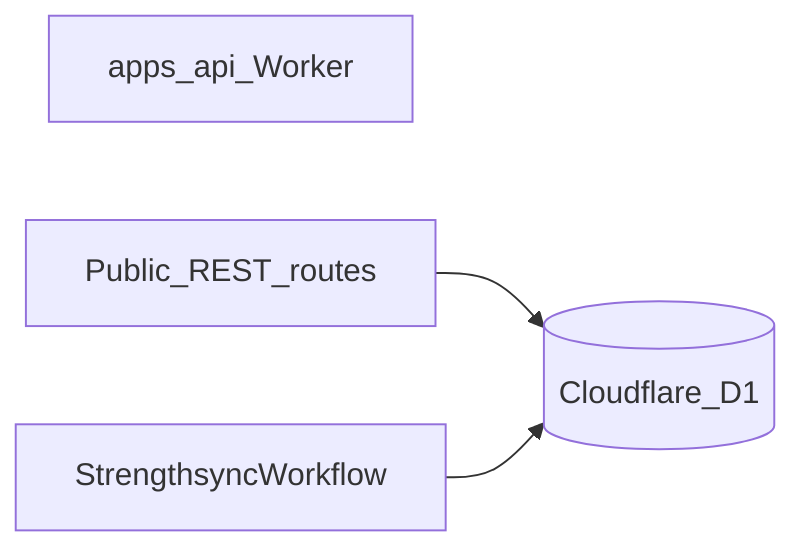

# MVP stack

Committed providers and platform choices for the MVP. This is intentionally a small, low-operations stack; free usage is used where it is genuinely available, not assumed where it is only a trial.

## Decisions

| Concern | MVP choice | Free-usage status | Decision |
| --- | --- | --- | --- |
| Product access | Auth0 — hosted login, bearer tokens | Free tier, 25k MAU against a cohort of 20 | Identity is the provider's; the API verifies a signed JWT on every `/api/*` request. See [auth.md](./auth.md) |
| Public API + chat | Hono on Cloudflare Workers | Yes | Use the existing Worker direction |
| SQL database | Cloudflare D1 + Drizzle ORM | Yes | Use D1 as the system of record and Drizzle as its typed data layer |
| Workflow orchestration | Cloudflare Workflows (in-Worker) | Yes | One workflow (`StrengthsyncWorkflow`) runs weekly progression and plan turnover; no local worker or tunnel |
| LLM evals/tracing | Braintrust | Yes | Target for workflow LLM calls; not wired in this pass and will be redefined in `server/src/agent` when tracing returns (see [evals.md](./evals.md)) |
| General platform observability | Cloudflare | Included platform telemetry | Use Cloudflare logs/analytics for Worker and D1 operations |
| Product analytics | PostHog | Free tier available | **MVP todo** — wire product metrics (see open todos below) |
| CI/CD | GitHub Actions | Yes | Build, test, and deploy from GitHub Actions |
| LLM | OpenAI API | No guaranteed permanent free tier | Continue with the current provider; set a spending limit |

## Access: Auth0

Superseded. **[auth.md](./auth.md) is the description of record** — the tenant
objects, the token, the data model, the request path, both clients and account
deletion. This row exists so the stack table has an entry, not to be a second
account of the same design that can drift from the first.

One line of it, because the rest of this document assumes it: athletes
authenticate on a hosted page at `auth.strengthsync.ai`, the browser sends a
short-lived RS256 access token, and `requireAuth` in `server/src/lib/auth.ts`
verifies it against the tenant's published key set and puts the internal athlete
id on the request context. That context, not the URL, is what every handler
reads.

What used to be here described hand-rolled authentication: PBKDF2 over WebCrypto
at 30,000 iterations, a `client_credentials` table, an HS256 `SameSite=Lax`
cookie and a `SESSION_JWT_SECRET`. None of it exists — `issues/011-amputate-old-auth.md`
deleted the lot in one commit and `issues/012-token-verification-and-provisioning.md`
replaced it. The reasoning is kept in those issues rather than here, because a
superseded design is history and history belongs where it happened.

Two properties survive the change unaltered, and both are still load-bearing:

- **The guard runs in every environment.** There is deliberately no development
  exemption: a guard that is off while the code is being written is a guard
  nobody tests.
- **No route accepts an athlete identifier.** The athlete comes from the
  verified credential, so the only ids a caller can name are a plan's and a
  week's — and the repository scopes both to the caller. Reading someone else's
  data is not a request the API can express.

Two more that are new:

- **Static SPA assets stay public**; they contain no athlete data.
- **`/wf/*` is outside the guard.** `POST /wf/complete-week` starts a workflow
  instance for any caller that reaches the origin. Known and accepted for the
  MVP — see [api_contracts.md](./api_contracts.md).

Four things this bought that the previous design listed as absent: password
reset, email verification, social sign-in (the Apple and Google buttons are real
now, not disabled captions), and session revocation. They are the provider's
job, so they left [future_state_after_mvp/todos.md](../future_state_after_mvp/todos.md)
rather than shipping as work of ours. Roles and an invitation flow remain out of
scope: public sign-ups are disabled at the connection and the cohort is created
by hand, which removes the invite code as a concept rather than relocating it.

## Cloudflare Workers + Hono

Cloudflare Workers remains the public API, SPA edge layer, streaming chat gateway, and D1 access layer. Hono is the HTTP framework.

The Workers Free plan currently includes 100,000 requests per day and 10 ms CPU per request ([pricing](https://developers.cloudflare.com/workers/platform/pricing/), [limits](https://developers.cloudflare.com/workers/platform/limits/)). That is sufficient for a small private MVP; move to Workers Paid before traffic or API CPU work requires it.

## Cloudflare D1

D1 is the relational system of record for `Coach`, `Client`, `ClientProfile`, `Plan`, and `Week` described in [domain_model.md](./domain_model.md). Drizzle ORM's D1 driver for its schema, migrations, typed queries, and repository layer. Is the best fit Workers-specific with D1.

### Workflow data access

Cloudflare Workflow running **inside** `server`. It receives the `DB` binding the same way the public API does and uses `createDb(this.env.DB)` to read and write D1 directly. 

- `server` owns all D1 reads/writes, whether from a request handler or a workflow step.
- `STRENGTHSYNC_WORKFLOW` binds the `StrengthsyncWorkflow` entrypoint to the Worker (see [workflows.md](./workflows.md)).
- The browser never reaches D1 directly.
- There is one data writer boundary: the Worker itself.

### Atomic writes

Use Drizzle's D1 `db.batch([...])` API for lifecycle commands that must be atomic, including archiving the old plan, activating a new plan, and creating week 1. Never use `db.transaction()` with D1.

## Workflow orchestration: Cloudflare Workflows

The MVP runs the weekly-turn workflow as a Cloudflare Worker Workflow inside `server`, bound as `STRENGTHSYNC_WORKFLOW`. Durable execution is provided by the platform: each `step.do` records its output, steps re-run only after a real failure, and the instance resumes after a crash. See [workflows.md](./workflows.md) for the step model, the plan-turnover branch, and the retry policy.

`wrangler deploy` ships the workflow alongside the public API, so the workflow is available whenever the Worker is deployed.

Workflow-visible retries and failure policy live in the workflow definition (`server/src/workflows/strengthsync-workflow.ts`) and in [workflows.md](./workflows.md)

## Evals and LLM observability: Braintrust (post-MVP)

Braintrust remains the target for workflow LLM evaluation, but it is **not wired** for MVP.

- Traces, prompts, outputs, latency, and evaluation scores will live in Braintrust.
- D1 remains product data only.

Cloudflare covers platform-level Worker/D1 logs and operational metrics. Braintrust will cover
LLM-specific traces and evals once reconnected; they are complementary.
See [evals.md](./evals.md) and [future_state_after_mvp/todos.md](../future_state_after_mvp/todos.md).

## CI/CD: GitHub Actions

GitHub Actions is the MVP pipeline:

1. Pull request: install, typecheck, lint, and unit tests.
2. Main: build and deploy `server` — including the `StrengthsyncWorkflow` entrypoint — and run schema migrations through the API/Worker deployment path.
3. Workflow orchestration tests are deferred: the Cloudflare Workflow runtime is not exercised in the test suite.

Production serves from `app.strengthsync.ai`, declared as a Workers custom domain in `server/wrangler.jsonc`; Cloudflare creates the record and its certificate on deploy. The apex belongs to the marketing site in the `strengthsync` repository.

## LLM: OpenAI API

Keep OpenAI for the MVP because the current agent core already uses it. This is a paid dependency; do not model it as a reliable free tier.

**Post-MVP:** set an LLM cost budget (project spend limit, model allowlist, per-workflow token cap). See [future_state_after_mvp/todos.md](../future_state_after_mvp/todos.md).

Do not opt into data-sharing token programs for client health/training context without an explicit privacy decision.

## Production / MVP open todos

Short notes only — not a design write-up:

- Product metrics via PostHog.
- Onboarding that generates the athlete’s initial plan.
