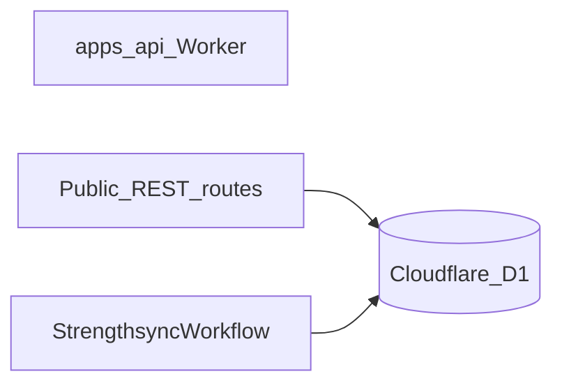

# MVP stack

Committed providers and platform choices for the MVP. This is intentionally a small, low-operations stack; free usage is used where it is genuinely available, not assumed where it is only a trial.

## Decisions

| Concern | MVP choice | Free-usage status | Decision |
| --- | --- | --- | --- |
| Product access | Client accounts: hashed passwords + a signed session cookie | No provider cost | Each athlete registers and signs in for themselves; the API Worker verifies the cookie on every `/api/*` request and reads the athlete's identity from it |
| Public API + chat | Hono on Cloudflare Workers | Yes | Use the existing Worker direction |
| SQL database | Cloudflare D1 + Drizzle ORM | Yes | Use D1 as the system of record and Drizzle as its typed data layer |
| Workflow orchestration | Cloudflare Workflows (in-Worker) | Yes | One workflow (`StrengthsyncWorkflow`) runs weekly progression and plan turnover; no local worker or tunnel |
| LLM evals/tracing | Braintrust | Yes | Target for workflow LLM calls; not wired in this pass and will be redefined in `server/src/agent` when tracing returns (see [evals.md](./evals.md)) |
| General platform observability | Cloudflare | Included platform telemetry | Use Cloudflare logs/analytics for Worker and D1 operations |
| Product analytics | PostHog | Free tier available | **MVP todo** — wire product metrics (see open todos below) |
| CI/CD | GitHub Actions | Yes | Build, test, and deploy from GitHub Actions |
| LLM | OpenAI API | No guaranteed permanent free tier | Continue with the current provider; set a spending limit |

## Access: client accounts with signed session cookies

Every athlete has their own account. `/auth/sign-up` and `/auth/sign-in` mint a
session cookie, `/auth/sign-out` expires it, and `/auth/session` answers who the
cookie belongs to on a cold page load. `app.ts` mounts `requireSession` on
`/api/*`, which verifies the cookie and puts the athlete's id on the request
context — that context, not the URL, is what every handler reads.

- **Passwords** are hashed with PBKDF2-SHA256 over WebCrypto (`server/src/lib/password.ts`): bcrypt and argon2 are not available on Workers, and WebCrypto is at the edge already, so no dependency is added. The iteration count is 30,000 — measured against the free plan's 10ms per-request CPU ceiling rather than copied from general guidance, which assumes no such ceiling. The stored value is self-describing, so that count can rise later without invalidating existing hashes.
- **The hash lives in its own table**, `client_credentials`, keyed by the athlete's id rather than on the `clients` row — so that no `SELECT *` over a client, which is how every client read is written, can carry a password hash to the browser.
- **The cookie** is `HttpOnly`, `SameSite=Lax`, path-wide, and `Secure` outside development. It carries an HS256 JWT whose payload is the athlete's id, issued-at and expiry, and nothing else. Thirty-day lifetime, defined once in `session-token.ts` and reused by the cookie so the two cannot drift.
- **`SESSION_JWT_SECRET`** is a Worker secret, never in the browser bundle or the repository. Rotating it invalidates every session already issued.
- **The guard runs in every environment.** There is deliberately no development exemption: a guard that is off while the code is being written is a guard nobody tests.
- **Require HTTPS.** The cookie is bearer-equivalent — whoever holds it is that athlete until it expires. It is signed, not encrypted: it cannot be tampered with, but it is not a place to keep anything secret.
- **Static SPA assets stay public**; they contain no athlete data.
- **`/wf/*` is outside the guard.** `POST /wf/complete-week` starts a workflow instance for any caller that reaches the origin. Known and accepted for the MVP — see [api_contracts.md](./api_contracts.md).

This **is** user identity, which the MVP's original decision here was not. That
decision was a single shared coach credential over HTTP Basic, and this document
carried a warning beside it: *not user identity — no per-user ownership, roles,
invitation flow or reliable logout — and replacing it with real identity must
happen before exposing client-facing accounts.* **That warning is addressed.**
Each athlete owns their data, signing out actually ends the session, and no route
accepts an athlete identifier in its path at all, so no request can name anyone
else; reading another athlete's data is not something the API can express.

Still absent, and deliberately out of scope for the MVP: roles, an invitation
flow, password reset, email verification, and social sign-in — the Apple and
Google buttons on the auth screens render disabled with a caption saying so.
No external auth provider is needed for any of it yet.

**Post-MVP auth notes:** password reset; SSO / social sign-in (Apple, Google, etc.).
See [future_state_after_mvp/todos.md](../future_state_after_mvp/todos.md).

## Cloudflare Workers + Hono

Cloudflare Workers remains the public API, SPA edge layer, streaming chat gateway, and D1 access layer. Hono is the HTTP framework.

The Workers Free plan currently includes 100,000 requests per day and 10 ms CPU per request ([pricing](https://developers.cloudflare.com/workers/platform/pricing/), [limits](https://developers.cloudflare.com/workers/platform/limits/)). That is sufficient for a small private MVP; move to Workers Paid before traffic or API CPU work requires it.

## Cloudflare D1

D1 is the relational system of record for `Coach`, `Client`, `ClientProfile`, `Plan`, and `Week` described in [domain_model.md](./domain_model.md). Drizzle ORM's D1 driver for its schema, migrations, typed queries, and repository layer. Is the best fit Workers-specific with D1.

### Workflow data access

Cloudflare Workflow running **inside** `server`. It receives the `DB` binding the same way the public API does and uses `createDb(this.env.DB)` to read and write D1 directly. 

- `server` owns all D1 reads/writes, whether from a request handler or a workflow step.
- `STRENGTHSYNC_WORKFLOW` binds the `StrengthsyncWorkflow` entrypoint to the Worker (see [workflows.md](./workflows.md)).
- The browser never reaches D1 directly.
- There is one data writer boundary: the Worker itself.

### Atomic writes

Use Drizzle's D1 `db.batch([...])` API for lifecycle commands that must be atomic, including archiving the old plan, activating a new plan, and creating week 1. Never use `db.transaction()` with D1.

## Workflow orchestration: Cloudflare Workflows

The MVP runs the weekly-turn workflow as a Cloudflare Worker Workflow inside `server`, bound as `STRENGTHSYNC_WORKFLOW`. Durable execution is provided by the platform: each `step.do` records its output, steps re-run only after a real failure, and the instance resumes after a crash. See [workflows.md](./workflows.md) for the step model, the plan-turnover branch, and the retry policy.

`wrangler deploy` ships the workflow alongside the public API, so the workflow is available whenever the Worker is deployed.

Workflow-visible retries and failure policy live in the workflow definition (`server/src/workflows/strengthsync-workflow.ts`) and in [workflows.md](./workflows.md)

## Evals and LLM observability: Braintrust (post-MVP)

Braintrust remains the target for workflow LLM evaluation, but it is **not wired** for MVP.

- Traces, prompts, outputs, latency, and evaluation scores will live in Braintrust.
- D1 remains product data only.

Cloudflare covers platform-level Worker/D1 logs and operational metrics. Braintrust will cover
LLM-specific traces and evals once reconnected; they are complementary.
See [evals.md](./evals.md) and [future_state_after_mvp/todos.md](../future_state_after_mvp/todos.md).

## CI/CD: GitHub Actions

GitHub Actions is the MVP pipeline:

1. Pull request: install, typecheck, lint, and unit tests.
2. Main: build and deploy `server` — including the `StrengthsyncWorkflow` entrypoint — and run schema migrations through the API/Worker deployment path.
3. Workflow orchestration tests are deferred: the Cloudflare Workflow runtime is not exercised in the test suite.

Production serves from `app.strengthsync.ai`, declared as a Workers custom domain in `server/wrangler.jsonc`; Cloudflare creates the record and its certificate on deploy. The apex belongs to the marketing site in the `strengthsync` repository.

## LLM: OpenAI API

Keep OpenAI for the MVP because the current agent core already uses it. This is a paid dependency; do not model it as a reliable free tier.

**Post-MVP:** set an LLM cost budget (project spend limit, model allowlist, per-workflow token cap). See [future_state_after_mvp/todos.md](../future_state_after_mvp/todos.md).

Do not opt into data-sharing token programs for client health/training context without an explicit privacy decision.

## Production / MVP open todos

Short notes only — not a design write-up:

- Product metrics via PostHog.
- Onboarding that generates the athlete’s initial plan.
