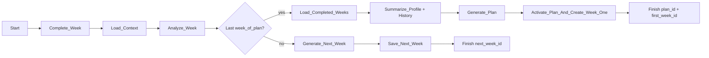

# Workflows

The MVP runs a single Cloudflare Worker Workflow — `StrengthsyncWorkflow` — that handles
every weekly turn of a client's plan in one durable run:

- completing the current week;
- analyzing it;
- and then either generating the next week (weeks remain) or, when the completed week is
  the plan's last, planning the next block and activating it.

It runs as a Cloudflare Workflow (binding `STRENGTHSYNC_WORKFLOW`, class
`StrengthsyncWorkflow`) exported from `server/src/index.ts`. Durable execution is
provided by the platform: each `step.do` re-records its output, steps are re-run only after
a real failure, and the instance resumes from where it left off after a crash. Product data
lives in D1; the workflow holds execution state.

The browser starts a workflow asynchronously and never waits for an LLM response. LLM tracing
is not wired in this pass.

## Trigger

**Trigger:** `POST /wf/complete-week` (`server/src/routes/cf-api.ts`)

**Input**

```typescript
type CompleteWeekParams = {
  clientId: string;
};
```

The entrypoint calls the `services/db` repository to freeze the client's current `in_flight`
week as `completed`, then proceeds. The route returns the new instance id and its initial
status.



## Shared rules

- Every `step.do` result is durable: on crash the instance resumes from the last recorded
  step output, so a step is never double-applied.
- LLM calls run through the in-Worker agent runtime (`server/src/agent/agent-core.ts`) with
  no recorder attached in this pass. LLM trace data is not stored in D1.
- LLM structured output is validated with shared Zod schemas before any write.
- Current coaching rules are included in every generation call. Rule versioning can be added
  later; MVP uses the active rules document.
- Product data remains in D1. The workflow retains execution state/result.

## Weekly progression path

This is the default branch: the completed week is not the plan's last.

1. **Complete week**  
   Mark the client's sole `in_flight` week `completed` (`completeWeek`). This freezes the
   schedule/logs used for coaching.

2. **Load context**  
   Read the active plan and client profile into workflow memory (`getPlan`, `getProfile`).
   The coaching rules are current and are carried alongside. This context is reused by the
   plan-turnover branch if the week happens to be the plan's last.

3. **Analyze week**  
   Invoke the LLM with completed-day status, skipped exercises, exercise feedback, performed
   sets versus prescription, the active plan, and coaching rules.  
   The analysis produces actionable guidance for generation only. It is held in workflow
   memory and traced in the agent runtime; it is **not persisted in D1**.

4. **Branch on the plan boundary**  
   If `week_index >= total_weeks`, take the plan-turnover branch below. Otherwise continue.

5. **Generate next week**  
   Call structured generation with the completed week, active plan, analysis, and coaching
   rules. The output is a full `WeekDay[]` schedule for the next dated week, validated by
   `NextWeekScheduleSchema` (seven days, all incomplete, empty logs).

6. **Save next week**  
   Persist the validated schedule as the sole next `in_flight` week (`saveNextWeek`).

**Result**

```typescript
type WeeklyProgressionResult = {
  next_week_id: string | null; // "null" when this was the plan's last week
  plan_complete: boolean;
};
```

## Plan-turnover branch

When `week_index >= plan.total_weeks`, the completed week finished the plan. Instead of
ending, the workflow continues into plan generation — reusing context it already loaded
instead of reloading or re-prompting it:

- `currentPlan` → serves as the previous-plan structural reference;
- `userProfile` → the profile summary input;
- `coaching_rules` → included in every plan-generation call.

Carrying these across the branch avoids a second context read and reduces token spend
compared to starting plan generation as a separate process.

1. **Load completed-weeks history**  
   The only additional read: the completed weeks of the finished plan, for the history
   summary. Scoped to the active plan.

2. **Summarize profile and history in parallel**  
   Run two independent LLM calls using the coaching-rule prompts in
   `services/domain/src/coach/plan-generation.ts`:
   - profile summary: goals, loads, body composition, nutrition/recovery constraints,
     swimming, and schedule preferences;
   - history summary: adherence, progression, skipped sessions, and
     `easy`/`hard`/`heavy`/`light` feedback patterns across the finished block.

3. **Generate plan**  
   Invoke structured output generation with both summaries, the previous plan as a structural
   reference, coaching rules, and optional coach notes. The output is validated by
   `GeneratedPlanInputSchema`: new block metadata, canonical `week_template`, and coach-facing
   rationale.

4. **Activate plan and create week 1**  
   Call the repository function `activateGeneratedPlan` that atomically:
   - archives the prior active plan;
   - creates and activates the new plan;
   - creates week 1 from the new template.

   Prior plans and completed weeks remain in D1.

**Result**

```typescript
type PlanGenerationResult = {
  plan_id: string;
  first_week_id: string;
};
```

The rationale is stored on the generated `Plan`; summary text and other transient LLM
intermediates are not product records.

## Retry and failure policy

| Step | Retries | Notes |
| --- | --- | --- |
| Data reads/writes | Step default | Durable; internal writes are idempotent |
| Weekly analysis | 2 (1 s delay, linear) | Limits repeated token spend |
| Next-week generation | 2 (1 s delay, linear) | Structured-output validation failures are retryable |
| Profile/history summaries | 2 (1 s delay, linear) | Run independently, in parallel |
| Plan generation | 2 (1 s delay, linear) | Structured-output validation failures are retryable |

On final failure, the workflow instance is marked failed. Failure details are exposed only
through Cloudflare Workers Logs; the UI does not poll workflow status.

## Deferred behavior

- No scheduled weekly trigger: the user explicitly completes a week.
- Streaming coach chat is not part of the MVP workflow surface.
- No product-table `JobRun` or `LlmCall`: the workflow runtime provides execution records;
  LLM tracing is deferred.