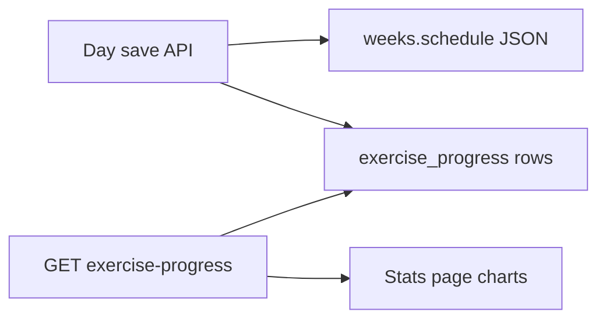

---

name: Exercise progress stats

overview: Add a client-scoped `exercise_progress` table (duplicated from week logs, weeks unchanged), dual-write it on day save, expose a plan-free read API, and ship a `/clients/:clientId/stats` page that charts volume over time per strength exercise. Document the design under `docs/future_state_after_mvp`.

todos:

  - id: schema-migration

    content: Add exercise_progress table, Drizzle schema, Zod model, unique index

    status: pending

  - id: dual-write

    content: Upsert/delete progress rows inside saveDay and updateDayLog

    status: pending

  - id: api-endpoint

    content: GET /api/clients/:clientId/exercise-progress + repo + api_contracts

    status: pending

  - id: stats-ui

    content: Route, resource, toExerciseStatsCharts (Zod), recharts page, nav link

    status: pending

  - id: future-state-doc

    content: Write docs/future_state_after_mvp/[exercise-progress-stats.md](http://exercise-progress-stats.md)

    status: pending

  - id: tests

    content: Cover upsert/list/skip-delete and chart transform

    status: pending

isProject: false

---

# Exercise progress stats

## Decisions (locked)

- **Write:** dual-write on day save `POST .../save` and `PATCH .../days/:dayIndex`); do not change the `weeks` table.

- **Chart Y:** volume = `series × reps × weight_kg` (null when weight is null).

- **Scalars:** same as history — `series = sets.length`, `reps` / `weight_kg` from the first performed set. Mark with a `warning:` comment (ceiling: first-set only; upgrade to per-set sum later).

- **Route:** `/clients/:clientId/stats` (matches track/history; not a bare `/stats`).

- **Day filter:** only `upper_body` and `leg_day`; skip `skipped` exercises; do not write rest/swimming/cardio.

## Data model

New SQL table `exercise_progress` in [services/db/src/schema.ts](services/db/src/schema.ts) + Drizzle migration. Leave `weeks` untouched.

| Column                      | Notes                                           |

| --------------------------- | ----------------------------------------------- |

| `id`                        | UUID PK                                         |

| `client_id`                 | FK → clients; ownership only — **no `plan_id`** |

| `exercise_key`              | e.g. `press_banca`                              |

| `name`                      | display name (duplicated)                       |

| `day_type`                  | `upper_body` | `leg_day`                        |

| `performed_on`              | ISO date from the week day                      |

| `series`                    | set count                                       |

| `reps`                      | first-set reps                                  |

| `weight_kg`                 | first-set weight, nullable                      |

| `created_at` / `updated_at` | timestamps                                      |

Unique index: `(client_id, exercise_key, performed_on)` so re-saves upsert.

Zod entity in [server/src/domain/model/index.ts](../../server/src/domain/model/index.ts) (e.g. `ExerciseProgressSchema`). Do **not** rewrite the domain_model ER for Week; document the extension in the future-state doc.



## Dual-write on day save

In [services/db/src/repositories/weeks.ts](services/db/src/repositories/weeks.ts) `saveDay` / `updateDayLog`):

1. Keep existing week JSON merge.

2. After a successful day write, for each non-skipped strength exercise on that day: upsert one `exercise_progress` row from the saved sets.

3. If an exercise is skipped (or no longer present): delete the matching `(client_id, exercise_key, performed_on)` row if any.

4. Prefer one D1 batch with the week update when practical; if batching is awkward, sequential upsert after the week write is fine for MVP size.

No backfill of historical weeks in this pass (table starts empty until the next day saves). Call that out in the future-state doc as a follow-up.

## API

New route module (e.g. [server/src/routes/exerciseProgress.ts](server/src/routes/exerciseProgress.ts)), mount under `/api` in [server/src/app.ts](server/src/app.ts):

```text

GET /api/clients/:clientId/exercise-progress

→ 200 { records: ExerciseProgress[] }

```

- Scoped by `clientId` only (no `planId`).

- Order by `performed_on` asc, then `exercise_key`.

- Repo: `listExerciseProgress(db, clientId)` in a new [services/db/src/repositories/exercise-progress.ts](services/db/src/repositories/exercise-progress.ts).

- Document in [docs/architecture/api_[contracts.md](http://contracts.md)](docs/architecture/api_[contracts.md](http://contracts.md)).

UI client: add `listExerciseProgress` + response Zod wrapper in [client/src/api/client.ts](client/src/api/client.ts), plus a small `statsResource.ts` like history.

## UI `/clients/:clientId/stats`

Mirror history page patterns:

1. Route in [client/src/App.tsx](client/src/App.tsx).

2. Page under `client/src/routes/stats/`.

3. Nav link in [client/src/components/app-shell/appShell.tsx](client/src/components/app-shell/appShell.tsx) (use selected/current `clientId`, same as other links).

**Zod transform** (same style as [client/src/routes/history/toWeekHistory.ts](client/src/routes/history/toWeekHistory.ts)):

- `toExerciseStatsCharts(records)` → parse into something like:

```ts

{ exercise_key, name, points: [{ date, volume }] }[]

```

- `volume = series  reps  weight_kg` when `weight_kg != null`; drop points with null weight.

- Group by `exercise_key`; one chart (or chart section) per exercise.

**Chart:** add **recharts** to `@strengthsync/client` (none installed today). Simple line chart: X = date, Y = volume. Keep layout consistent with existing app shell / history — no marketing-style redesign.

Empty state when there are no records yet (expected until new day saves land).

## Docs

Add [docs/future_state_after_mvp/[exercise-progress-stats.md](http://exercise-progress-stats.md)](docs/future_state_after_mvp/[exercise-progress-stats.md](http://exercise-progress-stats.md)):

- Why: track strength progression per client across plans.

- Table + dual-write + plan-free GET + stats UI.

- Explicit: weeks table unchanged; duplicated data is intentional and simple.

- Follow-ups: backfill from completed weeks; richer volume (sum of set products); optional exercise_key filter.

Do not expand MVP scope in [docs/mvp_[scope.md](http://scope.md)](docs/mvp_[scope.md](http://scope.md)) beyond a one-line pointer if useful; primary write-up stays in future_state.

## Tests (minimum)

- Repo or domain helper: upsert + list; skip deletes row; volume transform unit test in UI `toExerciseStatsCharts.test.ts`) covering null weight and grouping.

- One API route smoke if the existing weeks tests have an easy pattern to copy.

## Out of scope

- Changing `weeks` schema or removing JSON logs.

- Plan association / plan-scoped stats.

- Historical backfill.

- Cross-client analytics.

- Writing from the week-complete workflow only (writes are on day save).

