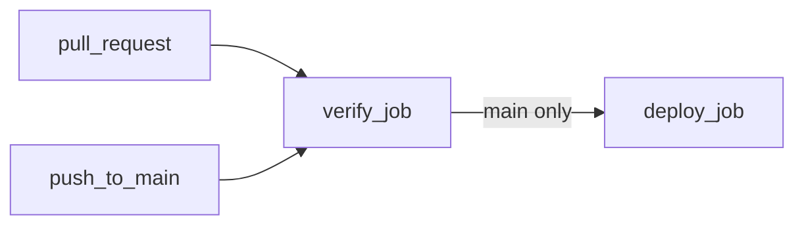

# CI/CD setup and rollout

How `.github/workflows/ci.yml` is wired, what it needs configured on GitHub
before it can deploy, and how to verify it end to end. See
[`turborepo.md`](../architecture/turborepo.md) for how the underlying task
graph and `--affected` filtering work, and
[`typescript_metrics.md`](../architecture/typescript_metrics.md) /
[`monorepo_structure.md`](../architecture/monorepo_structure.md) for the
foundations this pipeline builds on.

## Pipeline shape

- **`verify`** runs on every PR and every push to `main`: `deps:check`, then
  `typecheck`/`lint`/`test`, all scoped with `--affected`.
- **`deploy`** runs only on push to `main`, only after `verify` passes
  (`needs: verify`). It runs `build`/`deploy` scoped with `--affected` —
  today that means `apps/api` (and, as a forced graph dependency,
  `apps/ui`'s build for its static assets). `apps/workflows` has no
  `deploy` task and is never touched here; it stays a manual local rollout
  (see [`local_worker.md`](./local_worker.md)).

## One-time GitHub setup

Before the first push to `main` that's expected to deploy:

1. **Repo secrets** (Settings → Secrets and variables → Actions, or scoped
   to the `production` environment below):
   - `CLOUDFLARE_API_TOKEN` — a token with Workers Scripts (Edit) and D1
     (Edit) permissions for the target account. `wrangler deploy` and
     `wrangler d1 migrations apply --remote` both need it; there is no
     dry-run/offline mode for the D1 migration step, so a placeholder value
     will hang on an interactive login prompt in a non-interactive runner
     rather than failing fast.
   - `CLOUDFLARE_ACCOUNT_ID` — the target Cloudflare account ID.
2. **`production` environment** (Settings → Environments): `ci.yml`'s
   `deploy` job targets `environment: production`. Creating it is optional
   (GitHub will run the job without protection rules if it doesn't exist),
   but it's the natural place to add required reviewers or restrict which
   branches can deploy, and to scope the two secrets above to only this
   job instead of every workflow in the repo.
3. **D1 database must already exist remotely** — `wrangler d1 create
   strengthsync` and the resulting `database_id` in
   [`apps/api/wrangler.jsonc`](../../apps/api/wrangler.jsonc) is a
   prerequisite this pipeline assumes, not something it creates.
4. Confirm the `main` branch already has at least one prior commit before
   relying on the `deploy` job's affected-diff on the very first push after
   adding this workflow — see "First push after adding this workflow"
   below.

No change is needed for `apps/workflows`: it keeps deploying manually per
[`local_worker.md`](./local_worker.md#deploy-procedure).

## `--affected` base resolution

Both jobs resolve the git ref to diff against via
[`resolve-turbo-base.sh`](../../.github/workflows/resolve-turbo-base.sh)
rather than turbo's built-in GitHub Actions auto-detection, which has
[known resolution failures](https://github.com/vercel/turborepo/issues/12650)
on the detached-HEAD checkouts `actions/checkout` produces:

| Event | Base used |
| --- | --- |
| `pull_request` | the PR's base branch sha (`github.event.pull_request.base.sha`) |
| `push` (to `main`) | the sha `main` pointed to before this push (`github.event.before`) |
| First push to a new branch / force-push with no prior tip | `HEAD~1` (rather than assuming everything changed) |

This requires `actions/checkout` with `fetch-depth: 0` in both jobs — a
shallow clone doesn't have the history to diff against.

## First push after adding this workflow

`github.event.before` on the push that introduces `ci.yml` itself is the
commit before this change landed, so the diff naturally includes every
file this feature touched (`turbo.json`, the workspace `package.json`
changes, etc.) — expect the first `verify`/`deploy` run to touch more
packages than a typical day-to-day change, then settle into the normal
narrow `--affected` scope on subsequent pushes.

## Verifying the pipeline

Everything below was run locally (this environment has no GitHub Actions
access) to validate the logic `ci.yml` depends on; treat the first real PR
and the first real push to `main` as the actual end-to-end verification.

**Already verified locally:**

- `pnpm deps:check`, `pnpm typecheck`, `pnpm lint`, `pnpm test` all pass
  from a clean install (see [`typescript_metrics.md`](../architecture/typescript_metrics.md)
  for the typecheck baseline).
- `pnpm typecheck:affected` (and the `lint`/`test`/`build` equivalents)
  correctly narrows to only the changed leaf package when editing e.g.
  `apps/ui`, and correctly expands to all six packages when editing
  `services/domain` (everything depends on it) — see
  [`turborepo.md`](../architecture/turborepo.md#caching).
- `pnpm build:affected` with a change to only `apps/api` still builds
  `apps/ui` first and `wrangler deploy --dry-run` successfully reads its
  `dist/` as the assets directory — the `@strengthsync/api#build` →
  `@strengthsync/ui#build` graph edge in `turbo.json` works under
  `--affected`, not just a full run.
- `resolve-turbo-base.sh`'s four branches (PR base sha, push before-sha,
  zero-sha fallback, no-sha fallback) all resolve to the expected ref.
- `wrangler deploy --dry-run` (the `build` task) succeeds fully offline
  with placeholder `CLOUDFLARE_API_TOKEN`/`CLOUDFLARE_ACCOUNT_ID` values.
  `wrangler d1 migrations apply --remote` (part of the `deploy` task) does
  **not** — it needs a real token and network access, confirming point 1
  in the setup checklist above.

**Verify for real, once secrets are configured:**

1. Open a small PR (e.g. a docs typo) and confirm the `verify` job runs
   and only lints/tests the packages actually touched.
2. Merge it to `main` and confirm the `deploy` job runs, applies migrations
   (check the D1 dashboard or `wrangler d1 migrations list strengthsync
   --remote`), and the Worker's `GET /health` reflects the new deploy.
3. Make an `apps/ui`-only change, merge, and confirm `deploy` still runs
   (`apps/api#build` depends on it) and the served assets updated.
4. Make a `services/db`- or `apps/workflows`-only change, merge, and
   confirm `deploy` either runs (if `apps/api` is a dependent — true for
   `services/db`) or is correctly skipped/no-op (true for
   `apps/workflows`, which has no `deploy` task at all).
